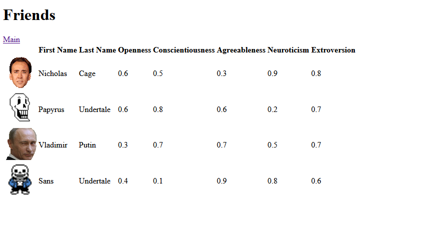

# Hacklahoma 2022 Repository for Alexander Lunsford

This was my attempt at making an entertaining game that would simulate the personalities and interactions of various digital characters..

## Inspiration

I was mainly inspired by the video game released for the Nintendo 3DS named "Tomodachi Life," with a similar premise of simulating the daily interactions of custom made avatars and allowing the player to observe the ensuing dramatic histories.

For this simulation game, I employed a model for personality that has recently become prominent in psychological research known as "the big 5." It involves 5 numerical scales that represents the range of human temperaments: Openness to experience (adventurousness), Conscientiousness (orderliness, pragmatism), Neuroticism (sensitivity to negative emotion, anxiety), Extroversion (affinity for public settings), and Agreeableness (politeness and obedience).

## What it does

The current iteration of the application simply runs a custom built web server and displays an HTML page with the information of various "simulated friends," the data of whom are extracted from server-side JSON config files.

## How I built it

I wrote the code myself using Rust, with guidance from the official Rust documentation, and using various packages like serde_json (for handling JSON files), and base64 (for displaying images).